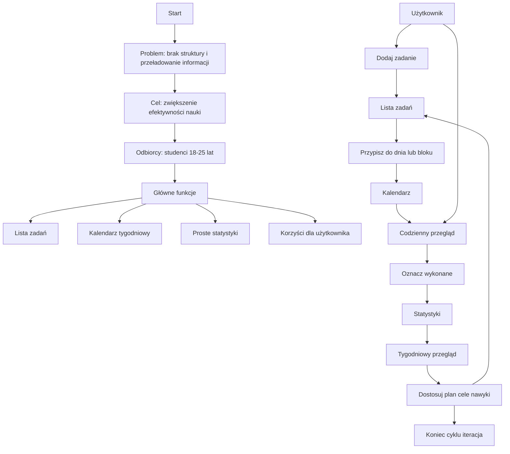

```mermaid
flowchart TD
    A[Start]
    B[Problem: brak struktury i przeładowanie informacji]
    C[Cel: zwiększenie efektywności nauki]
    D[Odbiorcy: studenci 18-25 lat]

    E[Główne funkcje]
    E1[Lista zadań]
    E2[Kalendarz tygodniowy]
    E3[Proste statystyki]

    F[Korzyści dla użytkownika]

    U[Użytkownik]
    G[Dodaj zadanie]
    H[Lista zadań]
    I[Przypisz do dnia lub bloku]
    J[Kalendarz]

    K[Codzienny przegląd]
    L[Oznacz wykonane]
    M[Statystyki]

    N[Tygodniowy przegląd]
    O[Dostosuj plan cele nawyki]

    Z[Koniec cyklu iteracja]

    A --> B --> C --> D --> E
    E --> E1
    E --> E2
    E --> E3
    E --> F

    U --> G --> H --> I --> J
    J --> K
    U --> K --> L --> M
    M --> N --> O --> H
    O --> Z
```
